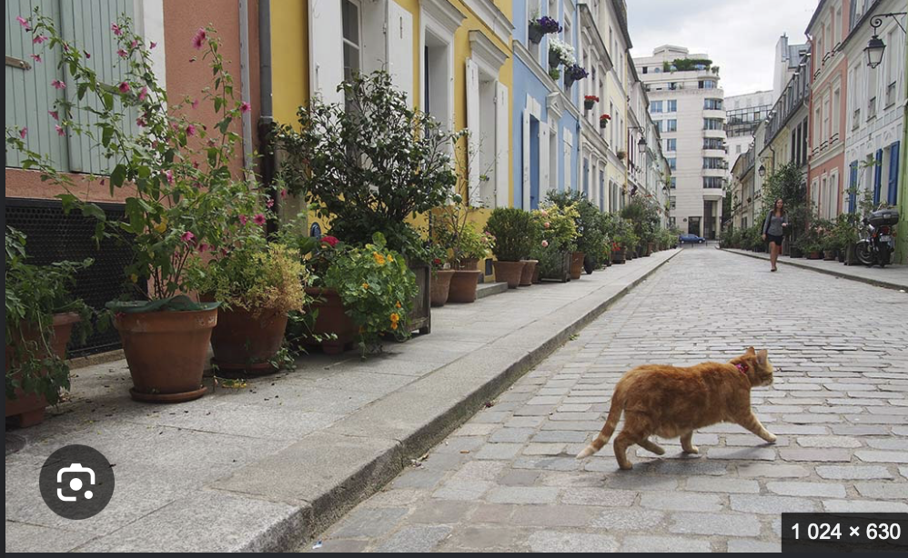
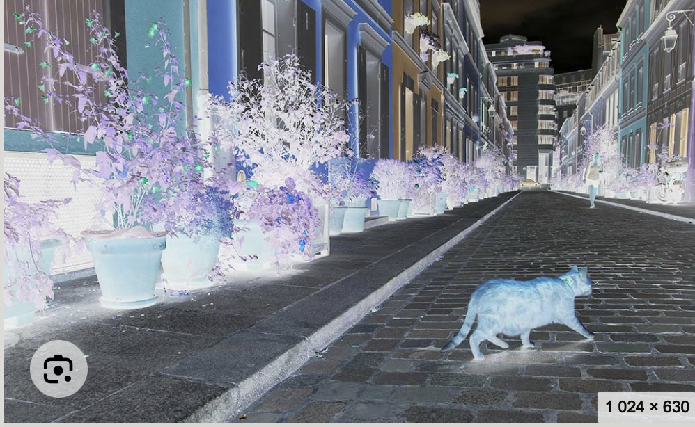

# Why this repo exists

As a person with ADHD/Autism the main problem I have is light-filter (aka. Color-filtering) during days of "high-importance" for focus and cognitive-memory with as low latency as possible; I will make this repo into a cheap VR-glasses that does one simple thing. Inverts-colors, a simple low-latency camera / its not really a camera for photos (it could be) but something to show images like this. Which for my also having (included. migraine light sensitivity) on top of this past 12-oclock I get cognitive-dissonance (self-diagnosis at its finest) thus I developed this.

## cam.ius or poi.cam (not sure on the name yet)

Simple example "walk in town?"

The PNG below was captured on a Mac whose display was already inverted. The *file* is the un-inverted pixels (macOS invert usually does not bake into screenshots), so it looks like a normal street on a normal screen. Invert your own display to see it the way the glasses would, or use the two buttons in [`example.html`](example.html).

[Invert / normal](example.html)

### As stored (normal display)

### Inverted (what the glasses do)

## Live path

Possible spec for the glasses + inverted-domain AI (DeepSeek *Thinking with Visual Primitives* as the training trajectory): [`docs/live-only.md`](docs/live-only.md).
